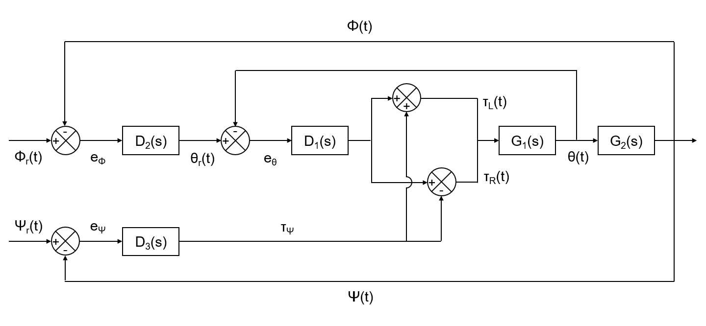
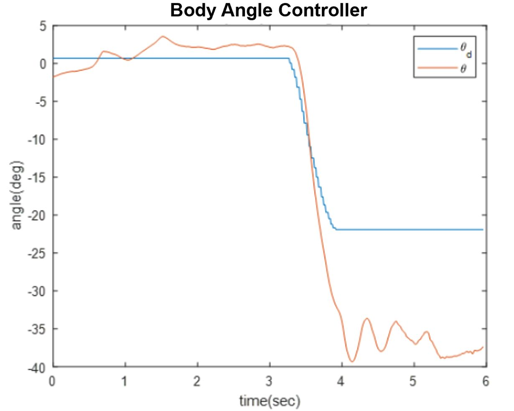
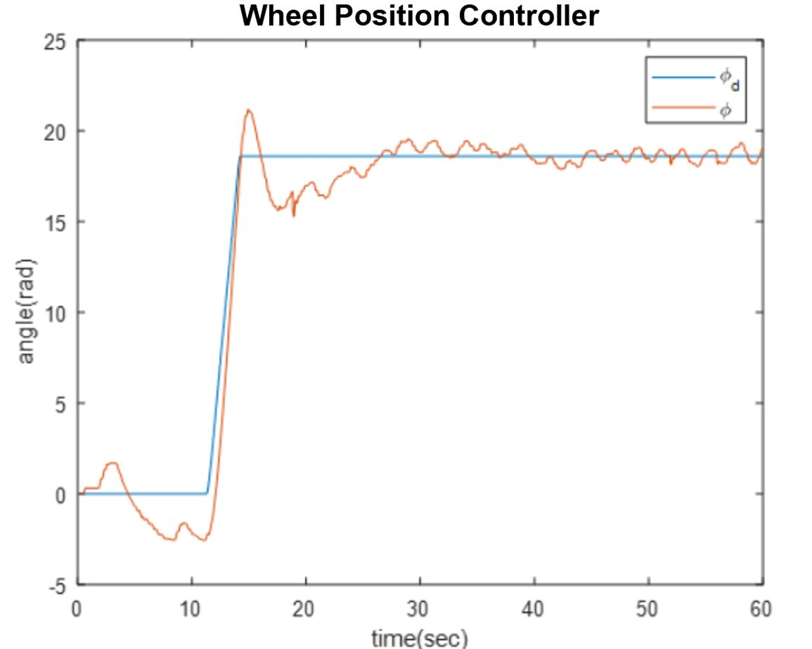
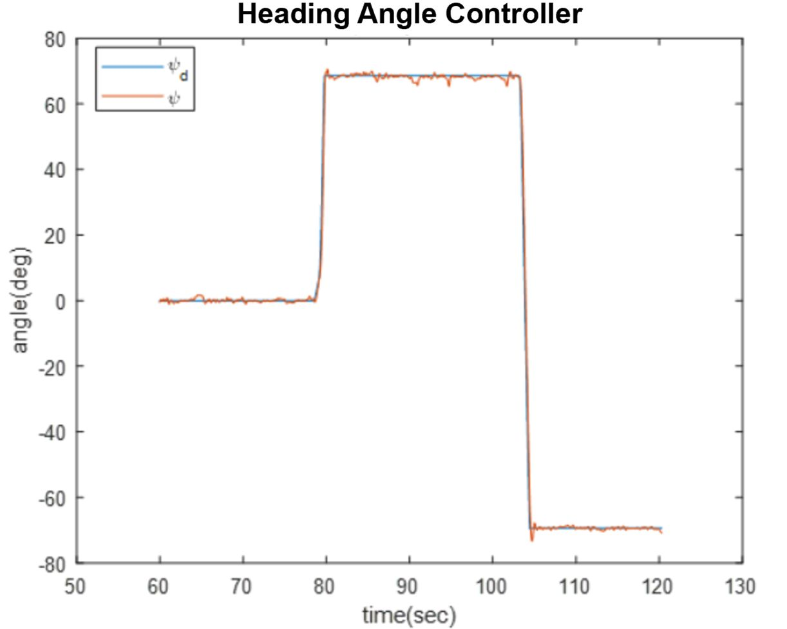
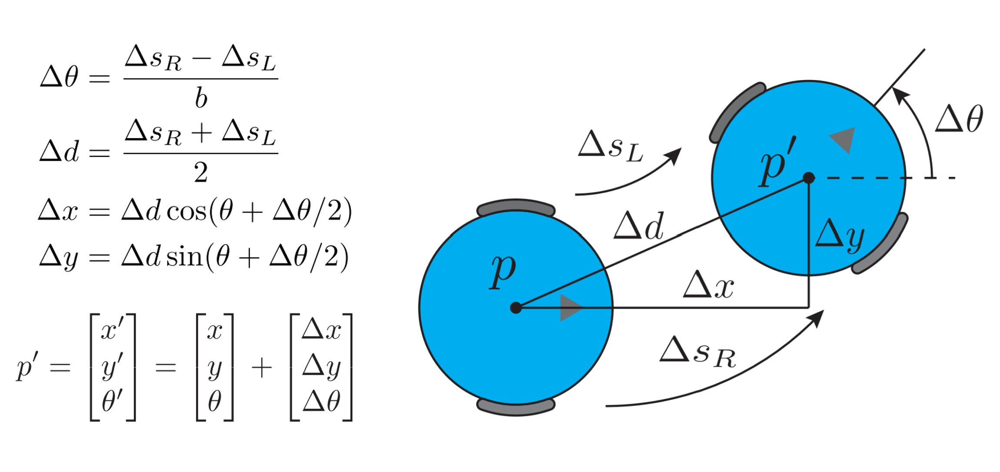
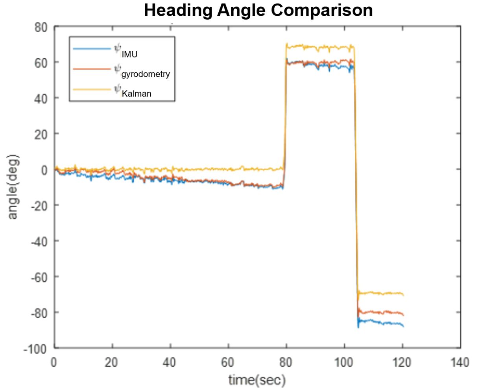
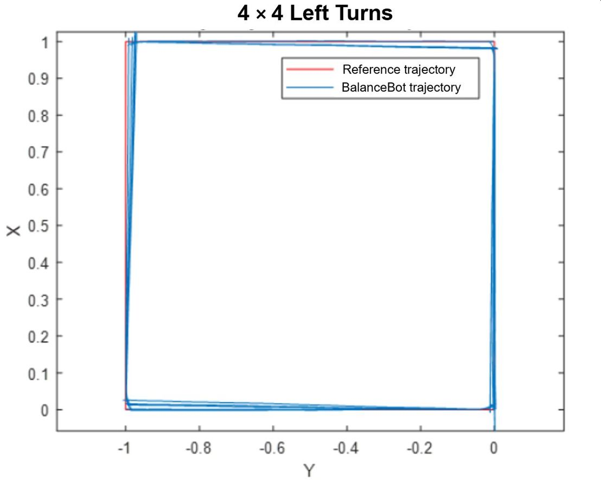

# Balancebot
The Balancebot project is one of three projects I took part in for the Robotic Systems Laboratory course (ROB 550) at the University of Michigan. It involved programming the functionality of a two-wheeled self-balancing robot that behaves like an inverted pendulum. The Robot Control Library (RCL) in C was used in conjunction with the Mobile Robot Cape (MRC), which was made custom and is capable of running the bot, voltage regulators, motor drivers, and IMU. This project was carried out with two other teammates, Ziyue Zhou and Yufei Zhu.

## Part 1: Balancing
The first part of the project involved measuring and characterizing the robot in order to inform the development of the PID controllers used to keep it upright.

### *System Modeling*
- ``common/mb_defs.h``: relevant parameters such as pins, chips, channels, polarities, gear ratios, resolutions, and measurements
- ``common/mb_motor.c``: functions that initalize, set velocity, and read velocity for the wheels using PWM and GPIO functions in RCL
- ``measure_moments/measure_moments.c``: functions to read and store gyroscope, accelerometer, and Euler angle data off of the IMU
  - Used data to calculate the moments of inertia about the x-, y-, and z-axes
- ``measure_motors/measure_motors.c``: functions used to calculate motor parameters like coil resistance, no load speed, motor constant, stall torque, etc.

### *Balance & Heading Controller*

  

- ``common/mb_controller.c``: implemented two PID controllers used to balance the robot upright, and a third parallel PID controller to control direction
  - Inner loop: body angle (theta) PID controller
  - Outer loop: wheel position (phi) PID controller
  - Parallel loop: heading angle (psi) PID controller

 

  
  
  

## Part 2: Motion Control
With the robot able to balance, the team then moved onto adding movement functionality, as well as methods to more accurately determine its relative position.

### *Manual & Autonomous Control*
- ``balancebot/balancebot.c``: manual and autonomous modes determine whether robot takes in steering inputs from controller or executes autonomous task, per competition tasks
  - Manual: increments reference wheel position and heading angle according to two directional sticks on controller
  - Autonomous: sets a destination point at the end of desired trajectory vector, then increments reference wheel position and heading angle values to travel along it

### *Odometry*

  

  (Source: ROB 550 lecture slides)

- ``common/odometry.c``: odometry functions added to locate robot based on wheel position, as read by wheel encoders
  - **Gyrodometry** algorithm corrects odometry heading angle estiamtes by monitoring large discrepancies between it and gyroscope data
  - **Kalman filter** uses odometry as the update step and gyroscope as the measurement for correction

 

  

## Competition/Challenges
At the end of the project period, all teams in the class pitted their robots against one another in four different events. Hence, functions that would allow the Balancebot to complete these tasks were created. Our team successfully completed all four tasks.

- ***Balancing on the Mark:*** autonomously stay balanced within 10cm of a target point for 20 seconds, and upright when external forces/disturbances are applied

- ***4x4 Left Turns:*** autonomously drive along the edges of a 1m square for four full laps while balancing and not crossing over

  

- ***Straight Line Drag Racing:*** autonomously drive straight for 11m as fast as possible, stopping within a 1m stop zone at the end, and staying balanced for 5 seconds

- ***Manual Obstacle Course:*** manually steer your robot through a series of gates in two different obstacle courses, one easier and one more difficult
