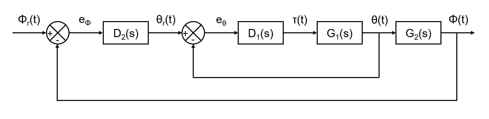
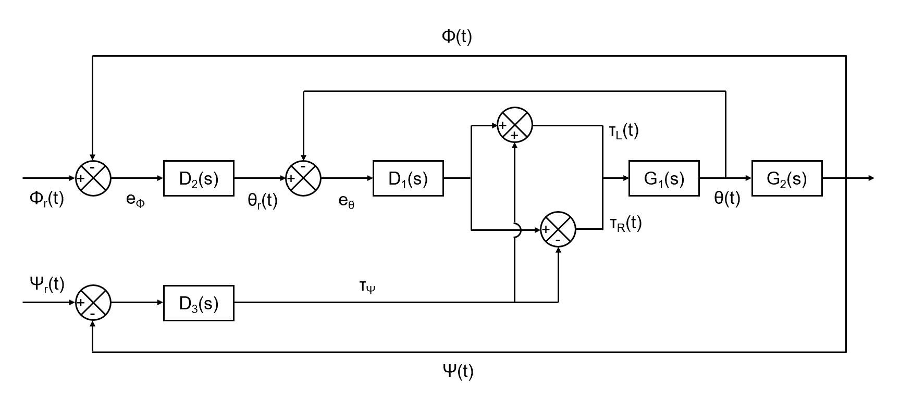

# BalanceBot
The BalanceBot project is one of three projects I took part in for the Robotic Systems Laboratory course (ROB 550) at the University of Michigan. It was done with a two other teammates, Ziyue Zhou and Yufei Zhu.

## Functionality
This project involved the implementation of the functionality and behavior of a BalanceBot, a two-wheeled self-balancing robot that behaves like an inverted pendulum. The Robot Control Library (RCL) was used in conjunction with the Mobile Robot Cape (MRC), which was made custom and is capable of running the bot, voltage regulators, motor drivers, and IMU.

### *Part 1: System Modeling*
- Defined relevant parameters such as pins, chips, channels, polarities, gear ratios, resolutions, and measurements
- Created functions that initalize, set velocity, and read velocity for the wheels using PWM and GPIO functions in RCL
- Wrote functions to read and store gyroscope, accelerometer, and Euler angle data off of the IMU
- Used aforementioned data to calculate the moments of inertia about the x-, y-, and z-axes
- Tested and calculated motor parameters like coil resistance, no load speed, motor constant, stall torque, etc.

### *Part 2: Balance Controller*
- Implemented Two PID controllers used to balance the robot upright, with reference wheel displacement as the output
- Inner loop: body angle (theta) PID controller
- Outer loop: wheel displacement (phi) PID controller
- Moving forwards or backwards relied on moving the reference wheel displacement ahead of or behind the current state

  

### *Part 3: Manual and Heading Control*
- Added heading angle (lambda) PID controller that runs parallel to the balance controller and controls direction of movement/steering
- Manual control programmed in that allows BalanceBot to be steered via controller

  

### *Part 4: Odometry and Motion Control*
- Odometry functions added to locate robot based on wheel displacement, as read by wheel encoders
- Gyrodometry algorithm utilized to mitigate error caused from pure odometry imprecision, leading to more accurate heading angle/position estimates

## Competition/Challenges
At the end of the project period, all teams in the class pitted their robots against one another in four different events. Hence, functions that would allow the BalanceBot to complete these tasks were created. Our team successfully completed all four tasks.

### *Balancing on the Mark*
Bot must stay balanced within 10cm of a target point for 20 seconds, and upright when external forces/distrubances are applied.

### *4x4 Left Turns*
Drive along the edges of a 1m square for four full laps while balancing and not crossing over.

### *Straight Line Drag Racing*
Race for 11m autonomous as fast as possible, stopping within a 1m stop zone at the end, and staying balanced for 5 seconds.

### *Manual Obstacle Course*
Using manual control, steer your robot through a series of gates in two different obstacle courses, one easier and one more difficult.
